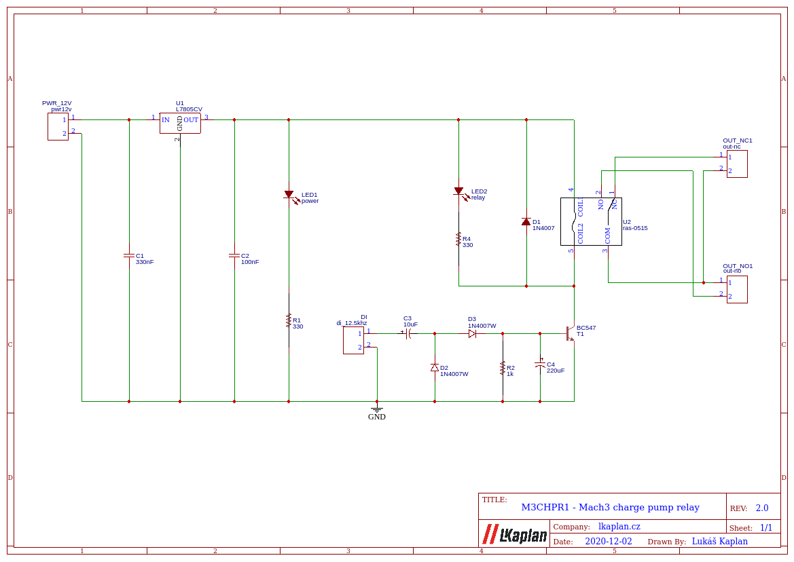

# M3CHPR1

MACH3 Charge Pump Relay v1

Smart relay which can detect charge pump signal (12.5kHz) from MACH3 CNC software. Relay is activated when "charge pump" signal is detected. 

Charge pum signal:

## Typical usage
I use it in E-Stop circuit. 'NO' (normaly-open) contacts are connected in series with end stops and E-Stop buttons. 

## Why use this module?
If you have your CNC machine connected via LPT to PC. Imagine that you turn on your machine, but your computer is not ready yet. I realized that PC during boot changes state of LPT pins unexpectedly. So it can be dangerous for your machine and even for you. We want to wait when MACH3 is ready - than we can unblock all moving parts of machine.

## How to build it?

### Schematic

### PCB

TODO - add PCB printable template

You can print it by any laser printer on "glossy" paper (typicaly newsletters, catalogs etc.). Then put it on your degreased blank PCB (30mm x 80mm) by printed side to cooper. Than take your iron, set temperature button approx. in the middle (two points / silk). Take newspaper and put it on the table, than put your PCB on it by paper down and then put one blank paper on it. Now you can start ironning - about 3-5 minutes. After take your PCB and rotate it by paper up, try to perfectly push paper to PCB by iron or by rubber roll. Then you can throw PCB with paper to water, wait for 5 minutes. Next step is carefuly remove paper from PCB => there shoud be nice printing on the cooper. Check printing quality and repair errors (by scratchin or by permanent marker). Then you can etch your PCB by ferric chloride. Best results are when you lay PCB (cooper down) on accid level - it should float (top side has to be dry).

### Part list
*  1x 5mm RED LED
*  1x 5mm GREEN LED
*  4x 2-pin screw terminal (5.08mm)
*  1x DIN Box (2 modules wide)
*  3x 1N4007 Diode
*  1x 5V Relay (RAS-0515A or similar)
*  1x BC547 
*  1x L7805CV
*  1x 1k resistor
*  2x 330R resistor
*  1x 330nF ceramic capacitor
*  1x 100nF ceramic capacitor
*  1x 10uF electrolytic capacitor
*  1x 220uF electrolytic capacitor

